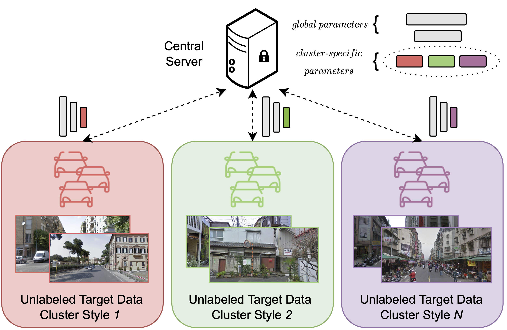

# Learning Across Domains and Devices: Style-Driven Source-Free Domain Adaptation in Clustered Federated Learning

**Official implementation** of [Learning Across Domains and Devices: Style-Driven Source-Free Domain Adaptation in
Clustered Federated Learning](https://arxiv.org/abs/2210.02326)

by **Donald Shenaj**<sup>\*,1</sup>, **Eros Fanì**<sup>\*,2</sup>, Marco Toldo<sup>1</sup>,
Debora Caldarola<sup>2</sup>, Antonio Tavera<sup>2</sup>, Umberto Micheli<sup>&#8224;,1</sup>,
Marco Ciccone<sup>&#8224;,2</sup>, Pietro Zanuttigh<sup>&#8224;,1</sup> and Barbara Caputo<sup>&#8224;,2</sup>

**Corresponding authors:** donald.shenaj@dei.unipd.it, eros.fani@polito.it

<sup>\*</sup> Equal contribution. <sup>&#8224;</sup> Equal supervision.
<sup>1</sup> Authors supported by University of Padova, Padua, Italy.
<sup>2</sup> Authors supported by Politecnico di Torino, Turin, Italy.



## Citation

If you find our work relevant to your research, or use this code, please cite our WACV 2023 paper:

```
@inproceedings{shenaj2023ladd,
  title={"Learning Across Domains and Devices: Style-Driven Source-Free Domain Adaptation in Clustered Federated Learning},
  author={Shenaj, Donald and Fan\`i, Eros and Toldo, Marco and Caldarola, Debora and Tavera, Antonio and Michieli, Umberto and Ciccone, Marco and Zanuttigh, Pietro and Caputo, Barbara},
  booktitle={Winter Conference on Applications of Computer Vision (WACV)},
  year={2023},
  organization={IEEE}
}
```

## Summary

In this work we propose a novel realistic scenario for Semantic Segmentation in Federated Learning: Federated
source-Free Domain Adaptation (FFreeDA). In FFreeDA, the server can pre-train the model on labeled source data.
However, as in the Source-Free Domain Adaptation (SFDA) setting, further accessing the source data is forbidden.
Clients can access only their **unlabeled** target dataset, but cannot share it with other clients nor with
the server. Moreover, there are many clients in the system and each of them has only a limited amount of images,
to emulate real-world scenarios. Therefore, after the pre-training phase, the training is fully unsupervised.
To address the FFreeDA problem, we propose LADD, a novel federated algorithm that assumes the presence of 
multiple distributions hidden among the clients. LADD partitions the clients into clusters based on the styles of the
images belonging to each client, trying to match them with their actual latent distribution. LADD shows excellent
performance on all benchmarks with a source dataset (GTA5) and three different targets (Cityscapes, CrossCity,
Mapillary), with diversified splits of the data across the clients.

## Setup

### Preliminary operations

1) Clone this repository.
2) Move to the root path of your local copy of the repository.
3) Create the ```LADD``` new conda virtual environment and activate it:
```
conda env create -f environment.yml
conda activate LADD
```

### Datasets

1) Download the the Cityscapes dataset from [here](https://www.cityscapes-dataset.com/downloads/) (```gtFine_trainvaltest.zip``` and ```leftImg8bit_trainvaltest.zip``` files).
2) Ask for the Crosscity dataset [here](https://yihsinchen.github.io/segmentation_adaptation_dataset/).
3) Download the Mapillary Vistas dataset from [here](https://www.mapillary.com/dataset/vistas).
4) Download the GTA5 dataset from [here](https://download.visinf.tu-darmstadt.de/data/from_games/).
5) Extract all the datasets' archives. Then, move the datasets' folders in ```data/[dataset_name]/data```, 
where ```[dataset_name]``` is one of ```{cityscapes, crosscity, mapillary, gta5}```.
```
data
├── cityscapes
│   ├── data
│   │   ├── leftImg8bit
│   │   │   ├── train
│   │   │   ├── val
│   │   ├── gtFine
│   │   │   ├── train
│   │   │   ├── val
│   ├── splits
├── gta5
│   ├── data
│   │   ├── images
│   │   ├── labels
│   ├── splits
├── crosscity
│   ├── data
│   │   ├── cities
│   ├── splits
├── mapillary
│   ├── data
│   │   ├── training
│   │   ├── testing
│   │   ├── validation
│   ├── splits
```

### Experiments' logging

Make a new [wandb](https://wandb.ai/site) account if you do not have one yet, and create a new wandb project.

### How to run

In the configs folder, it is possible to find examples of config files for some of the experiments to replicate the
results of the paper. Run one of the exemplar configs or a custom one from the root path of your local copy of the
repository:

```./run.sh [path/to/config]```

We provide config files to replicate the experiments in the paper:

1) run a pre-training script — e.g. ```./run.sh configs/pretrain_crosscity.txt``` and take the corresponding exp_id from
wandb
2) run our method — e.g. ```./run.sh configs/crosscity_LADD_classifier.txt```. Make sure to set
```load_FDA_id=[exp_id_pretrain]```

N.B. change the ```wandb_entity``` argument with the entity name of your wandb project.

N.B. always leave a blank new line at the end of the config. Otherwise, your last argument will be ignored.

## Results

### GTA5 &#8594; Cityscapes

| Setting      | Method                              | mIoU (%)              |
|--------------|-------------------------------------|-----------------------|
| centralized  | Oracle                              | 66.64 &#177; 0.33     |
| centralized  | Source Only                         | 24.05 &#177; 1.14     |
| centralized  | FTDA                                | 65.74 &#177; 0.48     |
| centralized  | MCD                                 | 20.55 &#177; 2.66     |
| centralized  | DAFormer                            | 42.31 &#177; 0.20     |
| FL-UDA       | MCD                                 | 10.86 &#177; 0.67     |
| **FFreeDA**  | FedAvg<sup>&#8224;</sup> + Self-Tr. | 35.10 &#177; 0.73     |
| **FFreeDA**  | **LADD (cls)**                      | **36.49 &#177; 0.13** |
| **FFreeDA**  | **LADD (all)**                      | **36.49 &#177; 0.14** |

<sup>&#8224;</sup> Same pretrain as LADD.

### GTA5 &#8594; Crosscity

| Setting     | Method                              | mIoU (%)              |
|-------------|-------------------------------------|-----------------------|
| centralized | Source Only                         | 26.49 &#177; 1.46     |
| centralized | MCD                                 | 27.15 &#177; 0.87     |
| FL-UDA      | MCD                                 | 24.80 &#177; 1.56     |
| **FFreeDA** | FedAvg<sup>&#8224;</sup> + Self-Tr. | 33.59 &#177; 1.25     |
| **FFreeDA** | **LADD (cls)**                      | 39.87 &#177; 0.14     |
| **FFreeDA** | **LADD (all)**                      | **40.09 &#177; 0.19** |

<sup>&#8224;</sup> Same pretrain as LADD.

### GTA5 &#8594; Mapillary

| Setting     | Method                              | mIoU (%)              |
|-------------|-------------------------------------|-----------------------|
| centralized | Oracle                              | 61.46 &#177; 0.21     |
| centralized | Source Only                         | 32.40 &#177; 0.71     |
| centralized | MCD                                 | 31.93 &#177; 1.89     |
| federated   | Oracle                              | 49.91 &#177; 0.49     |
| FL-UDA      | MCD                                 | 19.15 &#177; 0.75     |
| **FFreeDA** | FedAvg<sup>&#8224;</sup> + Self-Tr. | 38.97 &#177; 0.21     |
| **FFreeDA** | **LADD (cls)**                      | **40.16 &#177; 1.02** |
| **FFreeDA** | **LADD (all)**                      | 38.78 &#177; 1.82     |

<sup>&#8224;</sup> Same pretrain as LADD.
